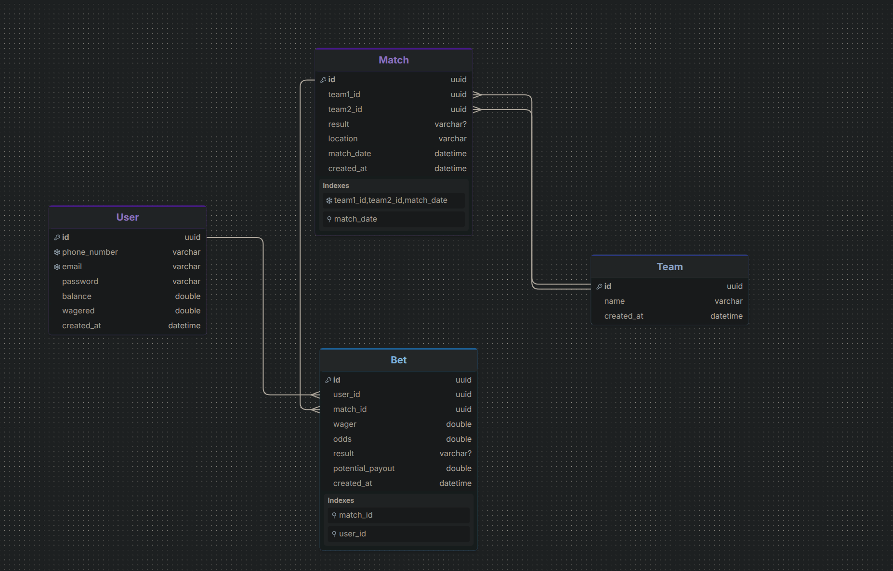

# Sportsbook — Sports Betting Platform

A full-stack sports betting application built with **Spring Boot** (backend) and **Angular** (frontend). Users can place bets on upcoming football matches, track results, and manage their betting history.

---

## What This Does

- Create and manage football teams and matches
- Place bets on matches with custom wager amounts and odds
- Track bet outcomes (Won / Lost / Pending / Voided)
- Auto-calculate potential payouts at the time of bet creation
- Paginated responses on all list endpoints
- Angular SPA frontend with routing, reactive forms, and HttpClient integration

---

## Database Schema



## Tech Stack

### Backend

| Layer | Technology |
|---|---|
| Language | Java 17 |
| Framework | Spring Boot 3.x |
| ORM | Spring Data JPA + Hibernate |
| Database | PostgreSQL |
| Validation | Jakarta Bean Validation |
| Boilerplate | Lombok |
| Build Tool | Maven |
| Server | Embedded Apache Tomcat |

### Frontend

| Layer | Technology |
|---|---|
| Language | TypeScript |
| Framework | Angular 21 |
| HTTP | Angular HttpClient + RxJS |
| Forms | Reactive Forms |
| Routing | Angular Router |
| State | Angular Signals |

---

## Project Structure

```
sportsbook/
├── backend/                         # Spring Boot application
│   └── src/main/java/
│       ├── controller/              # REST controllers
│       ├── service/                 # Business logic
│       ├── repository/              # Spring Data JPA repos
│       ├── model/                   # JPA entities
│       └── dto/                     # Request/Response DTOs
│
└── frontend/                        # Angular application
    └── src/app/
        ├── core/
        │   ├── models/              # TypeScript interfaces (User, Match, Bet, Team)
        │   ├── services/            # Angular services (user, match, bet, team)
        ├── pages/
        │   ├── auth/                # Login & Register pages
        │   ├── matches/             # Match list & detail pages
        │   ├── bets/                # My bets page
        │   └── profile/             # User profile page
        └── environments/            # dev/prod env settings
```

---

## API Endpoints

### Users — `/api/users`

| Method | Endpoint | Description |
|---|---|---|
| POST | `/api/users/register` | Register a new user |
| POST | `/api/users/login` | Login and get user session |
| GET | `/api/users/{id}` | Get user profile |
| PUT | `/api/users/{id}` | Update user profile |
| DELETE | `/api/users/{id}` | Delete user account |

### Teams — `/api/teams`

| Method | Endpoint | Description |
|---|---|---|
| GET | `/api/teams` | Get all teams (paginated) |
| GET | `/api/teams/{id}` | Get team by ID |
| POST | `/api/teams` | Create a team |
| PUT | `/api/teams/{id}` | Update a team |
| DELETE | `/api/teams/{id}` | Delete a team |

### Matches — `/api/matches`

| Method | Endpoint | Description |
|---|---|---|
| GET | `/api/matches` | Get all matches (paginated) |
| GET | `/api/matches/{id}` | Get match by ID |
| POST | `/api/matches` | Create a match |
| PUT | `/api/matches/{id}` | Update a match |
| PATCH | `/api/matches/{id}/result` | Set match result |
| DELETE | `/api/matches/{id}` | Delete a match |

### Bets — `/api/bets`

| Method | Endpoint | Description |
|---|---|---|
| GET | `/api/bets` | Get all bets (paginated) |
| GET | `/api/bets/{id}` | Get bet by ID |
| POST | `/api/bets` | Place a bet |
| PUT | `/api/bets/{id}` | Update a bet |
| PATCH | `/api/bets/{id}/result` | Settle a bet result |
| DELETE | `/api/bets/{id}` | Delete a bet |

---

## Getting Started

### Prerequisites

- Java 17+
- Maven 3.8+
- Node.js 18+ and npm
- Docker ( for PostgreSQL)
- Angular CLI (`npm install -g @angular/cli`)

---

### 1. Clone the repo

```bash
git clone https://github.com/genin6382/sportsbook.git
cd sportsbook
```

---

### 2. Set up PostgreSQL

```bash
docker run --name postgres-local \
  -e POSTGRES_PASSWORD=<dbpassword> \
  -e POSTGRES_DB=<dbname> \
  -p 5432:5432 \
  -d postgres
```

---

### 3. Configure `application.properties`

```properties
spring.datasource.url=jdbc:postgresql://localhost:5432/<dbname>
spring.datasource.username=<username>
spring.datasource.password=<password>
spring.jpa.hibernate.ddl-auto=update
spring.jpa.show-sql=true
```

---

### 4. Run the backend

```bash
cd backend/bettingapp
./mvnw spring-boot:run
```

Backend starts at `http://localhost:8080`

---

### 5. Run the Angular frontend

```bash
cd frontend
npm install
ng serve
```

Frontend starts at `http://localhost:4200`

---

## Architecture

### Backend — 3-Layer Architecture

```
HTTP Request
     ↓
Controller  →  Validates input, calls service, returns DTO as JSON
     ↓
Service     →  Business logic, converts DTOs ↔ Entities
     ↓
Repository  →  Database operations via Spring Data JPA
     ↓
PostgreSQL
```

### Frontend — Angular Architecture

```
User Interaction
     ↓
Component (Page)  
     ↓
Service         
     ↓
HttpClient        
     ↓
Spring Boot REST API (localhost:8080)
```

### Full Stack Request Flow

```
Angular Component
     ↓  calls service method
Angular Service
     ↓  http.get/post/put/delete → Observable
HttpClient + RxJS pipe (map, catchError)
     ↓  HTTP request
Spring Boot Controller
     ↓
Spring Boot Service + Repository
     ↓
PostgreSQL
     ↓  response JSON
Angular Component updates UI via Signals
```

---

## What I Learned Building This

### Backend
- Designing clean REST APIs with proper HTTP verbs and status codes
- JPA relationships (`@ManyToOne`, `@JoinColumn`) vs storing raw IDs
- The DTO pattern — keeping API contracts separate from database entities
- Why indexes matter and which columns to index
- Spring Boot's 3-layer architecture (Controller → Service → Repository)
- CORS configuration for frontend integration

### Frontend
- Switching from React to Angular — components, decorators, and Angular's opinionated structure
- RxJS Observables — lazy streams, `subscribe()`, and operators (`map`, `filter`, `tap`, `catchError`)
- Reactive Forms vs template-driven forms and when to use each
- Angular Signals as a replacement for `useState` — reactive state without Zone.js dependency
- How `HttpClient` integrates with Observables — every HTTP method returns an `Observable`
- Handling Spring Boot's `Page<T>` paginated responses in the Angular template
- The `@if` / `@for` control flow syntax introduced in Angular 17+
- Environment-based configuration for dev/prod API URL switching


